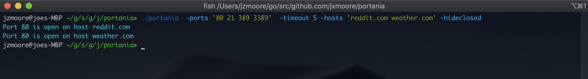

# Portania


Portania is a small concurrent port scanner written in Go that allows you to scan one or more ports on one or more hosts using a user defined number of GO routines.

<br>
<br>

## Installation
To begin running Portania you need have go installed, If you do not have the go command on your system, you need to [Install Go](http://golang.org/doc/install).

```shell
    cd ~/
    git clone https://github.com/jxmoore/Portania.git
    cd portania/
    go install .
```

If you receive an error similar to *'no install location....'* you need to set $GOBIN and you will also want to add GOBIN to path so you can run the command post install without changing paths :

```shell
    export GOBIN=$GOPATH/bin
    export PATH="$GOBIN:$PATH"
```

<br>
<br>

## Usage
Scanning a remote or local host is simple and quick : 
<p align="center"></p>
<br>

Lets break down the above command:

* `-ports '80 443 8080'` - This is a space delimited list of the port(s) we want to scan, in this case its just *80, 443 and 8080* but it can be any number of ports or just a single port.

* `-timeout 5` - This is the timeout period for a connection attempt. If the timeout is reached before the host responds on the given port the connection is deemed a failure and the port marked *'closed'*.

* `-workers 5` - This determines the number of routines to create when scanning. If your unfamiliar with GO you can think of GO routines similarly to threads in a language such as C# (although they are quite different). Portania pushes *'work'* items to a channel, these work items are the TCP address to be scanned, for example 'Google.com:443'. The workers are the routines that are created that pull work items (address to scan) from that channel, think of it like a pub/sub where the routines are the subscribers.

* `-hosts 'github.com google.com reddit.com yahoo.com'` - These are the remote hosts we want to scan. When specifying multiples like this you must quote it but your not limited to websites like in this example, these can be datacenter machine FQDNS, localhost etc... *But the connection will be made over **TCP**.*

There are of course other options, lets say we want to specify a range of ports rather than typing them all out, you can do this with the `-portrange` flag :
<br><p align="center"></p><br>

Or perhaps your not intrested in what fails, you only want to see the successful connections, this can be done with the `-hideclosed` flag :
<br><p align="center"></p><br>

To see all the available options and default values for things like the timeout you can use the `-help` flag. 
